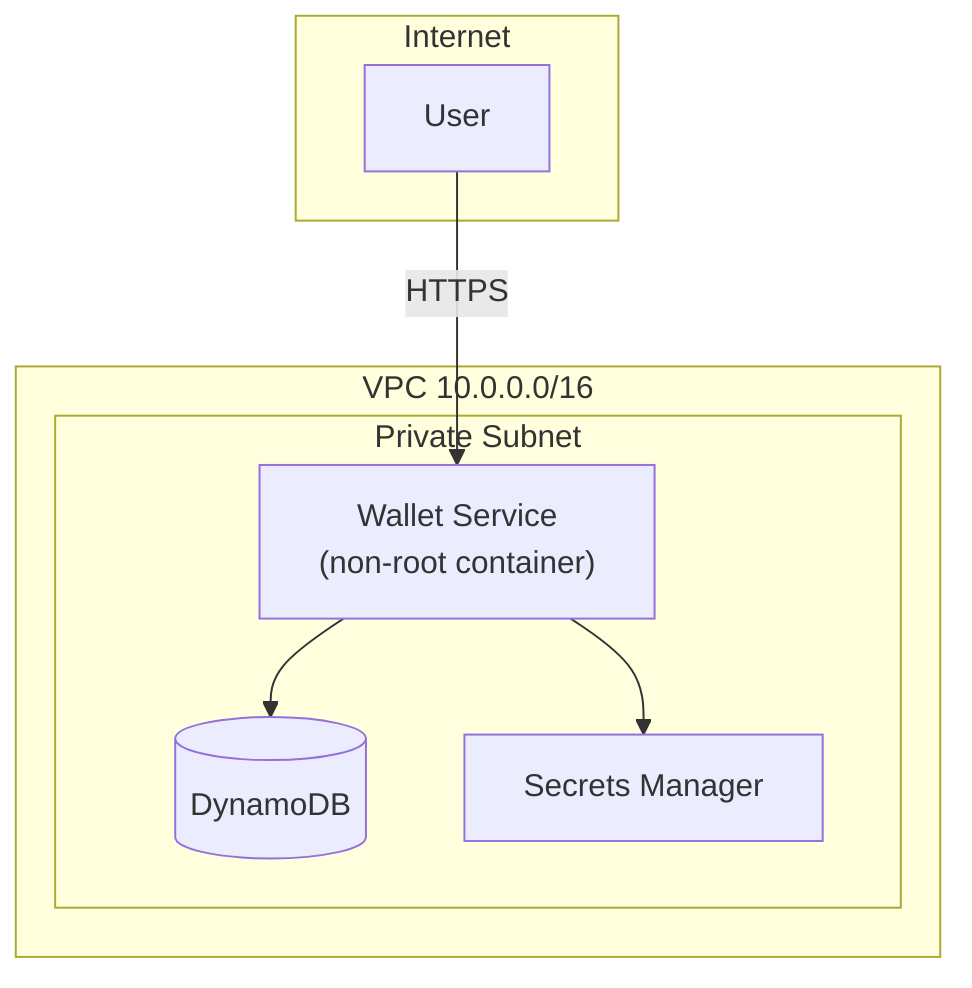

# NovaPay Wallet – Platform Pipeline & Hardening

**FirstBank Digital Factory – DevOps / DevSecOps Take-Home Task**

## What is real vs simulated

| Component              | Status                                      |
|------------------------|---------------------------------------------|
| Application + Dockerfile | Real                                      |
| GitHub Actions + GHCR  | Real                                        |
| Terraform              | Targets **LocalStack** (no real AWS account)|
| Staging deploy         | `docker-compose` (panel can run it)         |

## Architecture (Mermaid)



## Quick start (local)

```bash
# Build
docker build -t novapay-wallet .

# Prove non-root
docker run --rm novapay-wallet id
# Expected: uid=10001(novapay) gid=10001(novapay)

# Run
docker compose up -d wallet

# Test endpoints
curl localhost:8000/health
curl localhost:8000/ready
curl localhost:8000/version
curl localhost:8000/wallets/wal_001
curl localhost:8000/metrics
```

## How to run the pipeline locally

```bash
# Install act (https://github.com/nektos/act)
act -j lint-and-test
```

## How to apply IaC (LocalStack)

```bash
docker compose up -d localstack
cd terraform
terraform init
terraform plan
terraform apply
```

## Hard constraints satisfied

- ✅ No plaintext secrets in the repository or git history
- ✅ No IAM policy uses wildcard action or resource (`*`)
- ✅ Container runs as non-root (UID 10001) – demonstrable with `id`
- ✅ Pipeline fails (does not just warn) on critical vulnerability or detected secret

## Pipeline stages

1. Lint (ruff)
2. Unit tests (pytest)
3. SAST (bandit)
4. Dependency vulnerability scan
5. Secret scan (gitleaks) – fails the build
6. Trivy vulnerability scanner
6. Trivy secret scanner – fails on CRITICAL
7. Push to GHCR (main only)
8. Deploy to staging target (docker-compose)

## Secrets rotation approach

If a credential is leaked:

1. Immediately revoke / rotate the secret in Secrets Manager.
2. Force a new deployment so the service picks up the new value.
3. Audit access logs for the window of exposure.
4. Update any downstream consumers.

## Data residency note (stretch)

For a Nigerian regulated institution, all data (DynamoDB, Secrets Manager, logs) should reside in a West-Africa region or an on-prem / LocalStack-equivalent controlled environment. In this submission LocalStack keeps everything on the local machine; in production we would pin the region to `af-south-1` or an approved Nigerian data centre and document the residency decision for the CBN / NDPA conversation.
